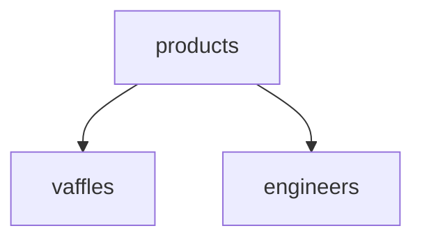

---
tags:
  - Obsidian
  - Руководство
---
# Содержание

1. **[[#Заголовки]]**
2. **[[#Текстовые стили]]**
3. **[[#Ссылки]]**
4. **[[#Блоки кода]]**
5. **[[#Списки]]**
6. **[[#Математические формулы]]**
7. **[[#Графы]]**
8. **[[#Цитаты]]**
9. **[[#Комментарии]]**

---
# Заголовки
	# Заголовок 1
	## Заголовок 2
	### Заголовок 3
	#### Заголовок 4
	##### Заголовок 5
	###### Заголовок 6

# Текстовые стили
## Полужирный
(ctrl+b)
\*\***bold**\*\*
## Наклонный
(ctrl+i)
\**italic*\*
## Зачёркнутый
\~\~~~Strikethrough~~\~\~
## Выделенный
\=\===Highlight==\=\=
## Полужирный с наклоном
\*\*\****Bold and italic***\*\*\*
# Ссылки
## Ссылка на другую заметку
\[\[[[Пример разметки .md файлов]]\]\]
## Ссылка на заголовок внутри того же файла
\[\[\#[[#Содержание]]\]\]
## Ссылка со вставкой
\!\[\[\#Содержание\]\]![[#Содержание]]
  
## Внешняя ссылка
\[Какой-то сайт\]\(https://google.com)
[Какой-то сайт](https://google.com)
## Ссылка на изображение
\!\[Фото|500x300\]\(https://avatars.mds.yandex.net/i?id=2363c68f20b8a535f0cb4aa0d66055ac8f1487c8-9870394-images-thumbs&n=13)

## Выноска

\>\[\!note\]
>[!note]

\>\[\!tip\]
>[!tip]

\>\[\!info\]
>[!info]

\>\[\!question\]
>[!question]

>[!todo]

>[!example]

>[!abstract]

> [!success]

> [!warning]

> [!failure]

> [!quote]

> [!bug]

## Концевая ссылка
[^1]: Концевая ссылка
# Блоки кода

## Обычный блок кода
Создаётся с помощью tab или 4 пробелов
    a = int(input())
## Выделенный блок кода
Обычный блок кода можно оформить, окружив тремя обратными кавычками
```python
'''А чтобы была подсветка кода надо указать язык сразу после первых трёх кавычек'''
a = file.write('tutorial')
```
## Код внутри строки
`Код обрамляется одиночными обратными кавычками`
# Списки
- маркерованный начинается со знака ' - '
1. Нумерованный начинается с ' 1. '
- [ ] Чекбокс начинается с ' - [ ] '
# Математические формулы
Блок формул выделяется с помощью ' \$\$ ' 
	$$ \begin{vmatrix}
	a & b\\
	c & d 
	\end{vmatrix}=ad-bc 
	$$
Однострочное математическое выражение выделяется одиночным знаком ' $ ' $e^{2i\pi} = 1$.

# Таблицы
Создаются с использованием ' | ' и ' - '
Внутри таблиц соответствующие символы следует экранировать

Name \| Type
\--|--
Value1 \| Value 2

| Name   | Type    |
| ------ | ------- |
| Value1 | Value 2 |

# Графы
Графы выводятся с помощью библиотеки mermaid и её функции graph TD


# Цитаты
Однажды мудрец сказал:
> Чтобы начать цитату, нужно использовать значок ' > '

 \- Подпись автора делается ниже и начинается с ' \\- '
# Комментарии
Обрамляются 
\%\%Двумя вопросительными знаками\%\%