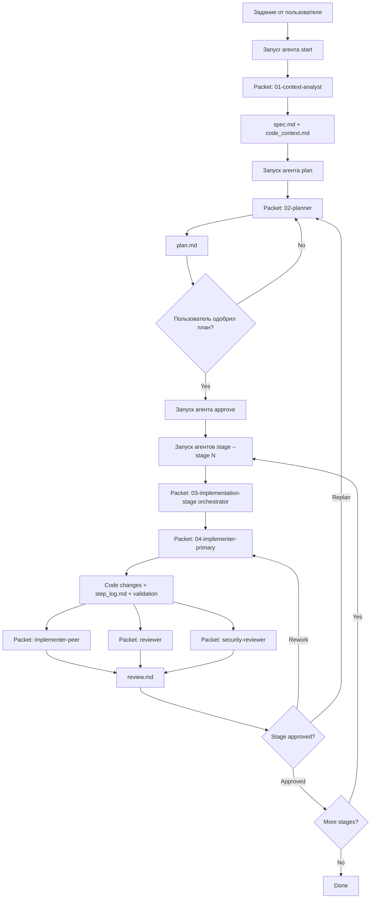

---
tags:
  - LLM
  - AI
  - разработка
---

```mermaid
flowchart TD
    A[Задание от пользователя] --> B[Запусr агента start]
    B --> C[Packet: 01-context-analyst]
    C --> D[spec.md + code_context.md]
    D --> E[Запуск агента plan]
    E --> F[Packet: 02-planner]
    F --> G[plan.md]
    G --> H{Пользователь одобрил план?}
    H -- No --> F
    H -- Yes --> I[Запуск агента approve]
    I --> J[Запуск агентов stage --stage N]
    J --> K[Packet: 03-implementation-stage orchestrator]
    K --> L[Packet: 04-implementer-primary]
    L --> M[Code changes + step_log.md + validation]
    M --> N[Packet: implementer-peer]
    M --> O[Packet: reviewer]
    M --> P[Packet: security-reviewer]
    N --> Q[review.md]
    O --> Q
    P --> Q
    Q --> R{Stage approved?}
    R -- Rework --> L
    R -- Replan --> F
    R -- Approved --> S{More stages?}
    S -- Yes --> J
    S -- No --> T[Done]
```
